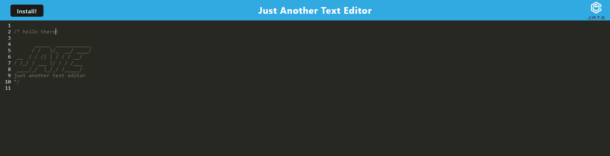

## Purpose: Progressive Web Applications (PWA): Text Editor

A text editor that runs in the browser as a single-page application that meets the PWA criteria. This editor features a number of data persistence techniques that serve as redundancy in case one of the options is not supported by the browser. This application will also function offline.
This application uses IndexedDB database. 

## Screenshot

## github URL: 
https://github.com/smith-utxo/PWA-Just-Another-Text-Editor-SPA

## Heroku Deployed URL: 
https://gentle-coast-88490.herokuapp.com/

## Legal Notice
 © Adam T. Smith, U of M Coding Boot Camp 
Licensed under the [MIT license](LICENSE)

## Contributors
- Adam T. Smith <smith.adam937@gmail.com>